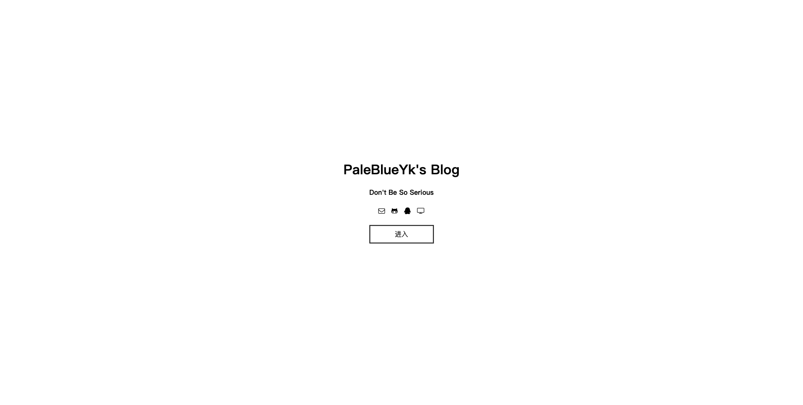
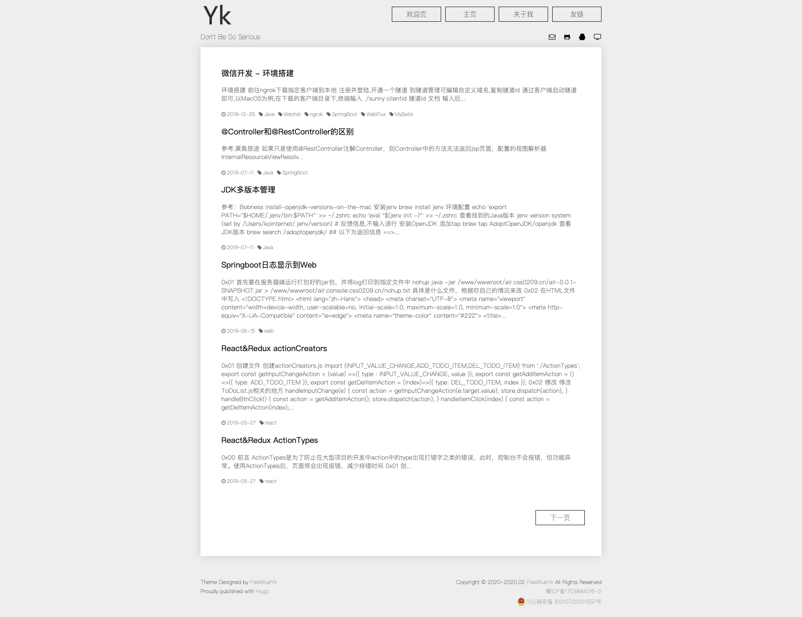

# Hugo主题：白(White)
和它的名字一样,这个主题很白,当然,它也非常简约。  
预览：[Demo](https://css0209.cn)
# 截图
[](./images/white_welcome.png)
[](./images/white_post_list.png)
# 下载安装
```bash
cd YourBlogRootDir
git submodule add https://github.com/PaleBlueYk/hugo-theme-white.git themes/White
```
# 使用
首先复制`exampleSite/content`文件夹和`exampleSite/archetypes`到你的博客根目录覆盖原文件

## 配置文件
修改配置文件,可参考`exampleSite/config.toml`
```toml
baseURL = "http://example.org/"
languageCode = "zh-cn"
title = "My New Hugo Site"
defaultContentLanguage = "eu-us"
theme = "white"
summaryLength = 100
hasCJKLanguage = true # 如果为true，则自动检测内容中的中文/日语/韩语。这将使.Summary和.WordCount正确行为的CJK语言。
paginate = 6 # 分页，没做太多css处理,不建议修改
enableEmoji = true

[params]
  title = "Title"                         # 网站title
  subTitle = "SubTitle"                   # 网站副标题
  author = "Your Name"                    # 你的ID
  description = "Description"             # 网站描述
  record = "蜀ICP备00000000号"             # 备案号
  policeRecordProvince = "川"             # 公安备案省份简称,如“川公网安备”则填"川"
  policeRecordNumber = "000000000000000"  # 公安备案号
  linksFeedback = "交换友链请在下方留言,并将本站添加到贵站的友链中,且确保贵站支持HTTPS协议!" # 友链页面下提示文字

# 评论系统
# Valine.
# You can get your appid and appkey from https://leancloud.cn
# more info please open https://valine.js.org
[params.valine]
  enable = false              # 文章页面下评论是否开启 默认关闭
  appId = "appId"             # appId
  appKey = "appkey"           # appkey
  placeholder = "快来留言吧"    # 留言板上
  visitor = true              # 不修改
  highlight = true            # 不修改
  linksEnable = true          # 友链下评论是否开启开启

# 图标采用fontawesome(http://www.fontawesome.com.cn/faicons/)
# key = value key与图标名相同
[social]
  github-alt = "https://github.com/<github名>"
  qq = "tencent://Message/?Uin=<QQ号>&amp;websiteName=q-zone.qq.com&amp;Menu=yes"
  television = "bilibili地址"
  envelope-o = "mailto:<邮箱>"

# 菜单 根据自己需求修改名称
[[menu.main]]
  identifier = "welcome"
  name = "Welcome"
  weight = "10"
  url = "/"
[[menu.main]]
  identifier = "home"
  name = "Home"
  weight = "20"
  url = "/posts"
[[menu.main]]
  identifier = "about"
  name = "About me"
  weight = "30"
  url = "/about"
[[menu.main]]
  identifier = "links"
  name = "Links"
  weight = "40"
  url = "/links"

# 友链
[[menu.links]]
 identifier = "Links1"
 name = "Links1"
 url = "https://css0209.cn/"
[[menu.links]]
 identifier = "Links2"
 name = "Links2"
 url = "https://gohugo.io/"
[[menu.links]]
 identifier = "Links3"
 name = "Links3"
 url = "https://github.com/"
[[menu.links]]
 identifier = "Links4"
 name = "Links4"
 url = "https://gohugo.io/"

```

## `favicon.ico`和`logo`
替换`favicon.ico`和`logo图片`在`<你的网站根目录>/static/img/favicon.ico`和`<你的网站根目录>/static/img/logo.png`

## 关于我、友链页面
**请注意,不要修改`content/links/_index.md`,也不要在`content/links`文件夹下添加任何md文件,以免造成页面出错**  
如需添加友链,请在配置文件下添加类似如下的内容：  
```toml
[[menu.links]]
 identifier = "LinksName"
 name = "LinksName"
 url = "https://gohugo.io/"
```
如需添加个人简介,请直接修改`content/about/_index.md`,注意:该页面所有`img`默认都为圆形，建议只放一个头像

# 更多功能仍在开发...